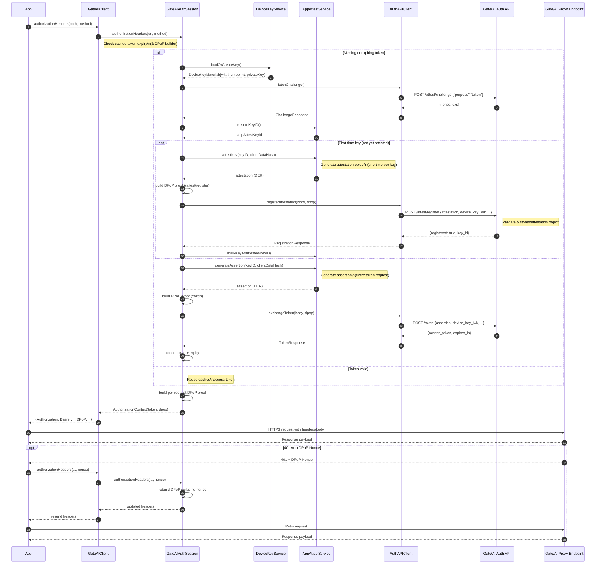

# GateAI iOS Integration Guide (Local Package)

This document covers the end-to-end steps for embedding the GateAI authentication client into an iOS app while the library is still sourced locally. It also highlights the responsibilities the host app must implement to satisfy the OAuth 2.0 + DPoP + App Attest security flow.

## 1. Prerequisites
- Xcode 16.0 or newer with Swift 6 toolchain.
- iOS 15+ deployment target.
- Apple Developer account with App Attest entitlement enabled for the app’s bundle identifier.
- Real iOS device for testing (App Attest is unavailable in the simulator unless you follow the workaround in `Proxy/AUTH-Simulators.md`).
- Access to your Gate/AI tenant domain (e.g. `yourteam.us01.gate-ai.net`) and the matching Apple Team ID + bundle identifier registered with Gate/AI.

## 2. Add the library as a local Swift Package
Until the package is published, you will reference it locally:

1. In Xcode, open your application project/workspace.
2. Choose **File ▸ Add Packages…**.
3. Click the **Add Local…** button (bottom-left of the sheet).
4. Select the `gate-ios` directory located at `GateAI/gate-ios` in this repository.
5. Confirm the package addition and add the `gate-ios` library product to the target(s) that will call Gate/AI.
6. In your app target’s **Build Settings**, confirm `Other Linker Flags` already include `-ObjC` (not typically required, but standard for packages). No additional flags are necessary.

> **Note:** When the package is published remotely, you can replace the local reference with the remote Git URL and semantic version.

## 3. Enable App Attest and Secure Enclave usage
Gate/AI relies on App Attest and a Secure Enclave key. Ensure the following:

- In your Apple Developer account, enable **App Attest** for the bundle identifier used by your app.
- In Xcode, verify the entitlement:
  1. Select your app target.
  2. Open the **Signing & Capabilities** tab.
  3. Add the **App Attest** capability if it’s not already present.
- No additional entitlements are required; Secure Enclave (Keychain) access is handled automatically.

## 4. Configure GateAI
Create a configuration object where you bootstrap the Gate/AI client (e.g. in an app-level dependency container):

```swift
import GateAI

#if targetEnvironment(simulator)
let devToken = Secrets.gateAIDevToken // Load from secure storage or env var
#else
let devToken: String? = nil
#endif

do {
    // Option 1: Convenience initializer with String URL (auto-detects bundle ID)
    let configuration = try GateAIConfiguration(
        baseURLString: "https://yourteam.us01.gate-ai.net",
        teamIdentifier: "ABCDE12345", // Your Apple Team ID (must be 10 alphanumeric characters)
        developmentToken: devToken,
        logLevel: .info
    )

    let gateAIClient = GateAIClient(configuration: configuration)

    // Option 2: Explicit initializer with URL object
    // let configuration = try GateAIConfiguration(
    //     baseURL: URL(string: "https://yourteam.us01.gate-ai.net")!,
    //     bundleIdentifier: "com.example.app",
    //     teamIdentifier: "ABCDE12345",
    //     developmentToken: devToken,
    //     logLevel: .info
    // )
} catch {
    print("Configuration error: \(error.localizedDescription)")
}
```

**Tips**
- The initializers validate inputs and throw `GateAIError.configuration` if validation fails.
- The `teamIdentifier` must be exactly 10 alphanumeric characters (e.g., "ABCDE12345").
- The convenience initializer automatically uses `Bundle.main.bundleIdentifier` if not explicitly provided.
- Provide the production base URL for real traffic. For staging, append `-staging` to the subdomain once it's available (e.g. `yourteam-staging.us01.gate-ai.net`).
- If the bundle ID or Team ID differs between QA and production apps, create per-environment configurations.

## 5. Request headers for proxied calls
Before calling any Gate/AI proxied endpoint, obtain authorization headers that include the access token and DPoP proof:

```swift
func performGateAIRequest() async throws {
    let apiPath = "openai/chat/completions"

    // Compose your request body and additional headers
    let bodyData = try JSONEncoder().encode(MyPromptRequest(...))

    let headers = try await gateAIClient.authorizationHeaders(
        for: apiPath,
        method: .post
    )

    var request = URLRequest(url: configuration.baseURL.appendingPathComponent(apiPath))
    request.httpMethod = "POST"
    request.httpBody = bodyData
    headers.forEach { request.setValue($0.value, forHTTPHeaderField: $0.key) }
    request.setValue("application/json", forHTTPHeaderField: "Content-Type")

    let (data, response) = try await URLSession.shared.data(for: request)
    guard let httpResponse = response as? HTTPURLResponse, httpResponse.statusCode == 200 else {
        throw MyAppError.unexpectedResponse
    }

    // Parse `data` as needed.
}
```

The library automatically:
- Mints a Secure Enclave key if needed and exports its JWK thumbprint.
- Performs `/attest/challenge`, App Attest assertion, and `/token` exchange (including DPoP).
- Caches the short-lived access token in-memory and refreshes ~60s before expiry.
- Handles `401` responses that include `DPoP-Nonce` by issuing a fresh proof once.

## 6. Handling nonce and error responses
If you bypass `performProxyRequest` and make requests directly:

- Pass any `DPoP-Nonce` header from a 401 response to `authorizationHeaders(for:method:nonce:)` on the retry.
- Inspect thrown `GateAIError.server` values for `error`/`error_description` details. Surface user messaging for `device_blocked`, `rate_limited`, etc.
- Use `gateAIClient.extractDPoPNonce(from:)` when working with higher-level networking stacks that capture errors centrally.

## 7. Using the built-in proxy helper
You can delegate proxy calls entirely to the client:

```swift
let (data, response) = try await gateAIClient.performProxyRequest(
    path: "openai/chat/completions",
    method: .post,
    body: bodyData,
    additionalHeaders: ["Content-Type": "application/json"]
)
```

This method automatically performs nonce retries and returns the raw `HTTPURLResponse` plus data for inspection.

## 8. Persisting state (optional)
- The device key lives in the Secure Enclave and is stored by tag; no additional persistence is required.
- The App Attest key ID is securely stored in Keychain (`kSecAttrAccessibleAfterFirstUnlockThisDeviceOnly`) for reuse across launches.
- Access tokens are held in-memory; avoid persisting unless your app runs long-lived background tasks.

## 9. Logging & privacy considerations
- Avoid logging raw tokens, assertions, or nonce values. Hash or redact if troubleshooting.
- Verify the device clock is accurate; skew beyond ±30s can cause `clock_skew` errors.

## 10. Simulator testing (Dev Token flow)
App Attest is unavailable on simulator hardware. Supply a `developmentToken` when constructing `GateAIConfiguration` (as shown above). The library will:
- Detect simulator builds via `targetEnvironment(simulator)` and call `/token` with the supplied `dev_token` while preserving DPoP + device-key protections.
- Ignore the token on real devices—App Attest remains mandatory on hardware.

Store Dev Tokens outside of source control (environment variables, CI secrets, or encrypted config files). Rotate or revoke them frequently and keep them scoped to staging-only tenants.

**Quick simulator checklist**
- ✅ Obtain a Dev Token from the Gate/AI Console (staging only).
- ✅ Supply the token through the `developmentToken` configuration parameter for simulator builds.
- ✅ Build/run the app in the simulator; verify `/token` responses include `"mode": "dev"`.
- ✅ Confirm device builds omit the dev token so App Attest is always used.

## 11. Updating the package
Because you referenced the package locally, you need to refresh dependencies manually when the package changes:

- In Xcode’s **Project Navigator**, right-click the `iOS-Swift` package ▸ **Update Package Dependencies**.
- Or run `xcodebuild -resolvePackageDependencies` from the command line in your app project.

## 12. Readiness checklist
- [ ] App Attest capability is enabled and entitlement delivered to devices.
- [ ] Added `GateAIConfiguration` using the correct tenant domain, bundle ID, and team ID.
- [ ] Networking layer wraps Gate/AI calls through the client to ensure per-request DPoP proofing.
- [ ] Error handling reports `device_blocked`, `nonce_expired`, and `rate_limited` states to the user or telemetry.
- [ ] Device testing completed on real hardware.

## 13. Next steps once published
When the library is published to a remote repository:

1. Remove the local package reference from Xcode.
2. Add the new remote dependency via **File ▸ Add Packages…** and enter the Git URL.
3. Pin to a semantic version that matches your release schedule.
4. Update release notes in your app to track Gate/AI SDK updates.

---

For any issues during integration, capture the API error payloads (minus sensitive data) and share them with the Gate/AI backend team for investigation.

# Sequence Diagram


