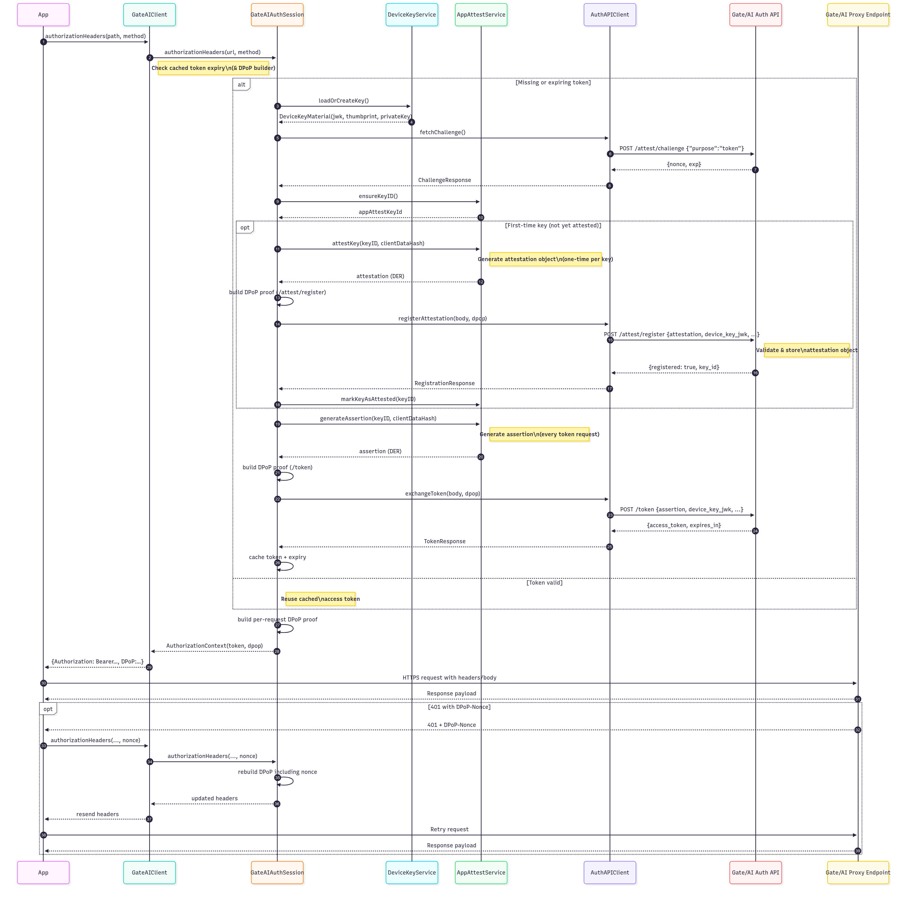

# Gate/AI

[](https://swift.org)
[](https://developer.apple.com/ios/)
[](LICENSE)

__Protect your secrets!__

Gate/AI is a secure authentication and API gateway client for mobile apps. It allows you to use secret key protected APIs without actually having the secret in your mobile app. It's an essential piece of security for protecting your secrets.

This is the supporting framework for iOS. It requires an account with Gate/AI to use. Find out more here: [https://gate-ai.net](https://gate-ai.net)

Access or setup your Gate here: [https://portal.gate-ai.net](https://portal.gate-ai.net)

## Features

- ✅ **Secure Authentication**: OAuth 2.0 + DPoP + App Attest flow handled automatically
- 🔐 **Secure Enclave**: Device keys stored in hardware-backed security
- 📱 **App Attest**: Leverages Apple's device attestation framework
- 🔄 **Token Management**: Automatic token refresh and caching
- 🛡️ **DPoP Proofing**: Per-request proof-of-possession for enhanced security
- 🔁 **Nonce Handling**: Automatic retry for nonce challenges
- 🛠️ **Development Support**: Simulator-friendly development token flow

## Requirements

- iOS 16.0+ / macOS 13.0+
- Xcode 16.0+
- Swift 6.0+
- Apple Developer account with App Attest entitlement added to your provisioning profile.

## Installation

### Swift Package Manager

Add the following to your `Package.swift` file:

```swift
dependencies: [
    .package(url: "https://github.com/LAND-MK-1/gate-ios.git", from: "1.0.0")
]
```

Or in Xcode:

1. File → Add Package Dependencies...
2. Enter the repository URL
3. Select the version or branch
4. Add to your target

### Local Development

For local development, you can add the package directly:

1. File → Add Package Dependencies...
2. Click "Add Local..."
3. Select the `gate-ios` directory

## Quick Start

```swift
import GateAI

// 1. Configure the client
let configuration = try GateAIConfiguration(
    baseURLString: "https://yourteam.us01.gate-ai.net",
    teamIdentifier: "ABCDE12345",  // Your Apple Team ID
    logLevel: .info
)

let client = GateAIClient(configuration: configuration)

// 2. Make authenticated requests
let requestBody = """
{
    "model": "gpt-4",
    "messages": [{"role": "user", "content": "Hello!"}]
}
""".data(using: .utf8)!

let (data, response) = try await client.performProxyRequest(
    path: "openai/chat/completions",
    method: .post,
    body: requestBody,
    additionalHeaders: ["Content-Type": "application/json"]
)

// 3. Process the response
if response.statusCode == 200 {
    let result = try JSONDecoder().decode(ChatResponse.self, from: data)
    print(result)
}
```

## Running on the Simulator

AppAttest is not available on simulators. In order to make a request to your gated service, you will need to get a dev token from the Gate/AI portal.

Set the `GATE_AI_DEV_TOKEN` environment variable in your Xcode scheme (`Cmd + Shift + ,` or Run ▸ Arguments ▸ Environment). The SDK only reads this value when the app is built for the simulator, ensuring dev tokens never ship in device/release builds:

Note: dev tokens provide unchecked access to your gated service. Keep it safe!

## Documentation

📚 **[Full Documentation](https://gateai-net.github.io/gate-ios/documentation/gateai/)**

- [Authentication Guide](https://gateai-net.github.io/gate-ios/documentation/gateai/authentication)
- [Making Requests](https://gateai-net.github.io/gate-ios/documentation/gateai/makingrequests)
- [Error Handling](https://gateai-net.github.io/gate-ios/documentation/gateai/errorhandling)
- [API Reference](https://gateai-net.github.io/gate-ios/documentation/gateai/)

## Usage Examples

### GET Request

```swift
let (data, response) = try await client.performProxyRequest(
    path: "openai/models",
    method: .get
)
```

### POST Request with JSON

```swift
struct ChatRequest: Codable {
    let model: String
    let messages: [Message]
}

let request = ChatRequest(model: "gpt-4", messages: [...])
let body = try JSONEncoder().encode(request)

let (data, response) = try await client.performProxyRequest(
    path: "openai/chat/completions",
    method: .post,
    body: body,
    additionalHeaders: ["Content-Type": "application/json"]
)
```

### Error Handling

```swift
do {
    let (data, response) = try await client.performProxyRequest(...)
} catch let error as GateAIError {
    switch error {
    case .server(let statusCode, let serverError, _):
        if serverError?.error == "rate_limited" {
            print("Rate limited. Please try again later.")
        }
    case .network(let underlying):
        print("Network error: \(underlying)")
    default:
        print("Error: \(error.localizedDescription)")
    }
}
```

## Setup Requirements

### 1. Enable App Attest

In Xcode:

1. Select your app target
2. Go to **Signing & Capabilities**
3. Add **App Attest** capability

In Apple Developer Portal (usually not needed):

1. Go to your app identifier
2. Enable **App Attest** capability
3. Save and regenerate provisioning profiles

### 2. Register Team ID

Add your Team ID and Bundle Identifier to your Gate.

1. Go to the [Gate/AI dashboard](https://portal.gate-ai.net/)
2. Edit your gate, enable iOS support and then add:
    - Team ID (10 alphanumeric characters, e.g., "ABCDE12345")
    - Bundle Identifier (com.acme.your-appp)


### 3. Obtain Development Token (for Simulator)

App Attest isn't supported in the simulator. To work around this, we provide a developer token to authenticate
when running in the simulator.

1. Go to the [Gate/AI dashboard](https://portal.gate-ai.net/)
2. View your Gate
3. Under Developer Tokens, click **Create Dev Token**
4. Copy the token and set the `GATE_AI_DEV_TOKEN` environment variable (Xcode scheme ▸ Run ▸ Arguments ▸ Environment, or your CI secret store)

> [!NOTE]
> Dev Tokens provide unchecked access to your gated service. Keep them out of source control and revoke them when compromised.

## Testing

### On Simulator

1. Create a Dev Token in the [Gate/AI dashboard](https://portal.gate-ai.net/)
2. Add `GATE_AI_DEV_TOKEN` to your scheme/environment (or CI) with that value
3. Run the simulator — the SDK reads the env var automatically and uses the dev token flow

### On Device

Physical devices use the full App Attest flow. No development token is needed.

## Logging

Enable logging to debug issues:

```swift
let configuration = try GateAIConfiguration(
    baseURLString: "https://yourteam.us01.gate-ai.net",
    teamIdentifier: "ABCDE12345",
    logLevel: .debug  // .off, .error, .warning, .info, .debug
)
```

Logs appear in:
- Xcode console
- Console.app (filter by subsystem: "com.gate-ai.sdk")
- System logs

Sensitive headers (Authorization, DPoP, API keys) are automatically redacted.

## Troubleshooting

### "teamIdentifier must be exactly 10 characters"

Your team ID must be the 10-character Apple Team ID, not your team name. Find it in:
- Xcode → Project Settings → Signing & Capabilities
- Apple Developer Portal → Membership

### "App Attest is not supported on this device"

- Use a physical iOS device (App Attest requires real hardware)
- Or configure a development token for simulator testing

### "Device attestation failed"

- Verify your team ID is registered with your Gate.
- Check your bundle ID matches your Gate
- Try resetting: `try client.clearAppAttestKey()`. This should not be necessary. Please create an issue if it was.

### "Invalid base URL"

Ensure the URL string is valid and includes the protocol:
- ✅ `https://yourteam.us01.gate-ai.net`
- ❌ `yourteam.us01.gate-ai.net` (missing protocol)

## Contributing

We hate using crappy frameworks and want good DX. If you have suggestions please let us know! Pull requests are welcome!

### Reporting Issues

Found a bug or have a question? [Open an issue](https://github.com/GateAI-net/gate-ios/issues) with:
- Clear description of the problem
- Steps to reproduce
- Expected vs actual behavior
- Xcode version and iOS version
- Relevant code snippets or error messages

### Submitting Pull Requests

1. Fork the repository
2. Create a feature branch (`git checkout -b feature/amazing-feature`)
3. Make your changes
4. Add tests for new functionality
5. Ensure all tests pass (`swift test`)
6. Commit your changes (`git commit -m 'Add amazing feature'`)
7. Push to the branch (`git push origin feature/amazing-feature`)
8. Open a Pull Request

### Guidelines

- Follow existing code style and conventions
- Add DocC documentation for public APIs
- Include tests for new features
- Update README if adding new functionality
- Keep PRs focused on a single feature or fix

## License

MIT License - see the [LICENSE](LICENSE) file for details.

This means you can freely use, modify, and distribute this SDK, including in commercial applications.

## See Also

- [Sample App](https://github.com/GateAI-net/gate-ios-sample-app/)
- [SDK Documentation](https://gateai-net.github.io/gate-ios/documentation/gateai/)
# Gate/AI Sequence Diagram
This is what we are doing behind the scenes to securely authenticate using DPoP and then send on your API service request.


