# Gate/AI

[](https://swift.org)
[](https://developer.apple.com/ios/)
[](LICENSE)

Secure authentication and API gateway client for iOS applications.

## Features

- ✅ **Automatic Authentication**: OAuth 2.0 + DPoP + App Attest flow handled automatically
- 🔐 **Secure Enclave**: Device keys stored in hardware-backed security
- 📱 **App Attest**: Leverages Apple's device attestation framework
- 🔄 **Token Management**: Automatic token refresh and caching
- 🛡️ **DPoP Proofing**: Per-request proof-of-possession for enhanced security
- 🔁 **Nonce Handling**: Automatic retry for nonce challenges
- 🛠️ **Development Support**: Simulator-friendly development token flow

## Requirements

- iOS 16.0+ / macOS 13.0+
- Xcode 16.0+
- Swift 6.0+
- Apple Developer account with App Attest entitlement

## Installation

### Swift Package Manager

Add the following to your `Package.swift` file:

```swift
dependencies: [
    .package(url: "https://github.com/LAND-MK-1/gate-ios.git", from: "1.0.0")
]
```

Or in Xcode:

1. File → Add Package Dependencies...
2. Enter the repository URL
3. Select the version or branch
4. Add to your target

### Local Development

For local development, you can add the package directly:

1. File → Add Package Dependencies...
2. Click "Add Local..."
3. Select the `gate-ios` directory

## Quick Start

```swift
import GateAI

// 1. Configure the client
let configuration = try GateAIConfiguration(
    baseURLString: "https://yourteam.us01.gate-ai.net",
    teamIdentifier: "ABCDE12345",  // Your Apple Team ID
    logLevel: .info
)

let client = GateAIClient(configuration: configuration)

// 2. Make authenticated requests
let requestBody = """
{
    "model": "gpt-4",
    "messages": [{"role": "user", "content": "Hello!"}]
}
""".data(using: .utf8)!

let (data, response) = try await client.performProxyRequest(
    path: "openai/chat/completions",
    method: .post,
    body: requestBody,
    additionalHeaders: ["Content-Type": "application/json"]
)

// 3. Process the response
if response.statusCode == 200 {
    let result = try JSONDecoder().decode(ChatResponse.self, from: data)
    print(result)
}
```

## Configuration

### Basic Configuration

```swift
let configuration = try GateAIConfiguration(
    baseURLString: "https://yourteam.us01.gate-ai.net",
    teamIdentifier: "ABCDE12345"
)
```

### With Development Token (Simulator)

```swift
#if targetEnvironment(simulator)
let devToken = ProcessInfo.processInfo.environment["GATE_AI_DEV_TOKEN"]
#else
let devToken: String? = nil
#endif

let configuration = try GateAIConfiguration(
    baseURLString: "https://yourteam.us01.gate-ai.net",
    teamIdentifier: "ABCDE12345",
    developmentToken: devToken,
    logLevel: .debug  // Enable detailed logging
)
```

### Custom Bundle Identifier

```swift
let configuration = try GateAIConfiguration(
    baseURLString: "https://yourteam.us01.gate-ai.net",
    bundleIdentifier: "com.example.MyApp",  // Override Bundle.main
    teamIdentifier: "ABCDE12345"
)
```

## Documentation

📚 **[Full Documentation](https://land-mk-1.github.io/gate-ios/documentation/gateai/)**

- [Authentication Guide](https://land-mk-1.github.io/gate-ios/documentation/gateai/authentication)
- [Making Requests](https://land-mk-1.github.io/gate-ios/documentation/gateai/makingrequests)
- [Error Handling](https://land-mk-1.github.io/gate-ios/documentation/gateai/errorhandling)
- [API Reference](https://land-mk-1.github.io/gate-ios/documentation/gateai/)

## Usage Examples

### GET Request

```swift
let (data, response) = try await client.performProxyRequest(
    path: "openai/models",
    method: .get
)
```

### POST Request with JSON

```swift
struct ChatRequest: Codable {
    let model: String
    let messages: [Message]
}

let request = ChatRequest(model: "gpt-4", messages: [...])
let body = try JSONEncoder().encode(request)

let (data, response) = try await client.performProxyRequest(
    path: "openai/chat/completions",
    method: .post,
    body: body,
    additionalHeaders: ["Content-Type": "application/json"]
)
```

### Error Handling

```swift
do {
    let (data, response) = try await client.performProxyRequest(...)
} catch let error as GateAIError {
    switch error {
    case .server(let statusCode, let serverError, _):
        if serverError?.error == "rate_limited" {
            print("Rate limited. Please try again later.")
        }
    case .network(let underlying):
        print("Network error: \(underlying)")
    default:
        print("Error: \(error.localizedDescription)")
    }
}
```

## Setup Requirements

### 1. Enable App Attest

In Xcode:

1. Select your app target
2. Go to **Signing & Capabilities**
3. Add **App Attest** capability

In Apple Developer Portal:

1. Go to your app identifier
2. Enable **App Attest** capability
3. Save and regenerate provisioning profiles

### 2. Register Team ID

Ensure your Apple Team ID is registered with your Gate/AI tenant. Contact your Gate/AI administrator with your:

- Team ID (10 alphanumeric characters, e.g., "ABCDE12345")
- Bundle Identifier
- Environment (production/staging)

### 3. Obtain Development Token (for Simulator)

1. Log into the Gate/AI Console
2. Navigate to **Developer Settings**
3. Generate a development token
4. Store it securely (environment variable or encrypted config)
5. **Never commit tokens to source control**

## Testing

### On Simulator

The SDK automatically uses development token flow on simulator:

```swift
#if targetEnvironment(simulator)
let devToken = "your-dev-token"
#else
let devToken: String? = nil
#endif

let configuration = try GateAIConfiguration(
    baseURLString: "https://staging.us01.gate-ai.net",  // Use staging
    teamIdentifier: "ABCDE12345",
    developmentToken: devToken
)
```

### On Device

Physical devices use the full App Attest flow. No development token needed.

### Running Tests

```bash
swift test
```

## Logging

Enable logging to debug issues:

```swift
let configuration = try GateAIConfiguration(
    baseURLString: "https://yourteam.us01.gate-ai.net",
    teamIdentifier: "ABCDE12345",
    logLevel: .debug  // .off, .error, .warning, .info, .debug
)
```

Logs appear in:
- Xcode console
- Console.app (filter by subsystem: "com.gate-ai.sdk")
- System logs

Sensitive headers (Authorization, DPoP, API keys) are automatically redacted.

## Troubleshooting

### "teamIdentifier must be exactly 10 characters"

Your team ID must be the 10-character Apple Team ID, not your team name. Find it in:
- Xcode → Project Settings → Signing & Capabilities
- Apple Developer Portal → Membership

### "App Attest is not supported on this device"

- Use a physical iOS device (App Attest requires real hardware)
- Or configure a development token for simulator testing

### "Device attestation failed"

- Verify your team ID is registered with your Gate/AI tenant
- Check bundle ID matches configuration
- Try resetting: `try client.clearAppAttestKey()`

### "Invalid base URL"

Ensure the URL string is valid and includes the protocol:
- ✅ `https://yourteam.us01.gate-ai.net`
- ❌ `yourteam.us01.gate-ai.net` (missing protocol)

## Contributing

We welcome contributions! Here's how you can help:

### Reporting Issues

Found a bug or have a question? [Open an issue](https://github.com/LAND-MK-1/gate-ios/issues) with:
- Clear description of the problem
- Steps to reproduce
- Expected vs actual behavior
- Xcode version and iOS version
- Relevant code snippets or error messages

### Submitting Pull Requests

1. Fork the repository
2. Create a feature branch (`git checkout -b feature/amazing-feature`)
3. Make your changes
4. Add tests for new functionality
5. Ensure all tests pass (`swift test`)
6. Commit your changes (`git commit -m 'Add amazing feature'`)
7. Push to the branch (`git push origin feature/amazing-feature`)
8. Open a Pull Request

### Guidelines

- Follow existing code style and conventions
- Add DocC documentation for public APIs
- Include tests for new features
- Update README if adding new functionality
- Keep PRs focused on a single feature or fix

## License

MIT License - see the [LICENSE](LICENSE) file for details.

This means you can freely use, modify, and distribute this SDK, including in commercial applications.

## See Also

- [Sample App](https://github.com/LAND-MK-1/gate-ios-sample-app/)
- [API Documentation](https://land-mk-1.github.io/gate-ios/documentation/gateai/)

# Gate/AI Sequence Diagram

```mermaid
sequenceDiagram
  autonumber
  participant App
  participant Client as GateAIClient
  participant Session as GateAIAuthSession
  participant KeySvc as DeviceKeyService
  participant Attest as AppAttestService
  participant API as AuthAPIClient
  participant AuthServer as Gate/AI Auth API
  participant Proxy as Gate/AI Proxy Endpoint

  App->>Client: authorizationHeaders(path, method)
  Client->>Session: authorizationHeaders(url, method)
  Note left of Session: Check cached token expiry\n(& DPoP builder)

  alt Missing or expiring token
    Session->>KeySvc: loadOrCreateKey()
    KeySvc-->>Session: DeviceKeyMaterial(jwk, thumbprint, privateKey)

    Session->>API: fetchChallenge()
    API->>AuthServer: POST /attest/challenge {"purpose":"token"}
    AuthServer-->>API: {nonce, exp}
    API-->>Session: ChallengeResponse

    Session->>Attest: ensureKeyID()
    Attest-->>Session: appAttestKeyId
    Session->>Attest: generateAssertion(keyID, clientDataHash)
    Attest-->>Session: assertion (DER)

    Session->>Session: build DPoP proof (/token)
    Session->>API: exchangeToken(body, dpop)
    API->>AuthServer: POST /token {..., dpop}
    AuthServer-->>API: {access_token, expires_in}
    API-->>Session: TokenResponse
    Session->>Session: cache token + expiry
  else Token valid
    Note right of Session: Reuse cached\naccess token
  end

  Session->>Session: build per-request DPoP proof
  Session-->>Client: AuthorizationContext(token, dpop)
  Client-->>App: {Authorization: Bearer…, DPoP:…}

  App->>Proxy: HTTPS request with headers/body
  Proxy-->>App: Response payload

  opt 401 with DPoP-Nonce
    Proxy-->>App: 401 + DPoP-Nonce
    App->>Client: authorizationHeaders(..., nonce)
    Client->>Session: authorizationHeaders(..., nonce)
    Session->>Session: rebuild DPoP including nonce
    Session-->>Client: updated headers
    Client-->>App: resend headers
    App->>Proxy: Retry request
    Proxy-->>App: Response payload
  end
```


